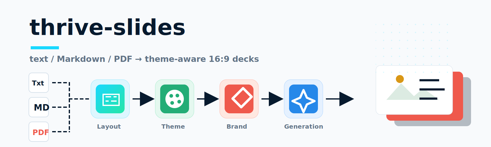

  

# thrive-slides — サンプルギャラリー（GitHub Pages 公開用）

thrive-slides の全スライドパターン（**5テーマ・14カテゴリ・全83パターン**）のサンプルを、ブラウザでそのまま閲覧できるよう GitHub Pages で公開するためのリポジトリです。

## ▶ 公開ページ

**https://ry-from-garage.github.io/thrive-slides-page/**

（ルートにアクセスすると、ギャラリー入口 `gallery/index.html` に自動で移動します）

## 収録内容

- `gallery/index.html` — ギャラリー入口（5テーマ・14カテゴリへのリンク）
- `gallery/*.html` — 14カテゴリ × 全83パターン（各カテゴリを相性の良いテーマで描画）
- `gallery-themes.html` — 5テーマのショーケース
- `gallery-layouts.html` — 14カテゴリ概観 ＋ ブランド融合デモ
- `slice-deck.html` — サンプルデッキ（完成例）

## 関連リポジトリ

- **本体（Skill / デザインシステム）:** https://github.com/ry-from-garage/thrive-slides

> このリポジトリは公開（GitHub Pages）専用です。ギャラリー HTML は本体リポジトリの `previews/` から複製しています。内容を更新する場合は本体側を更新し、ここへ反映してください。

## ライセンス

MIT
